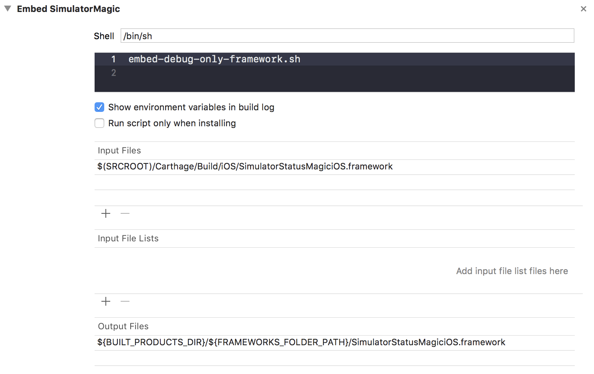

## Installing with Cocoapods

SimulatorStatusMagic is available through [CocoaPods](http://cocoapods.org). To install, simply add the following line to your Podfile:

```ruby
pod 'SimulatorStatusMagic', :configurations => ['Debug']
```

## Installing with Carthage

SimlatorStatusMagic is also available through [Carthage](https://github.com/Carthage/Carthage). Carthage will not make any modifications to your project, so installation is more involved than with CocoaPods. This describes a way of adding `SimulatorStatusMagic` so that it is only imported for `DEBUG` build configurations.

1. Add `SimulatorStatusMagic` to your `Cartfile`:
```
github "shinydevelopment/SimulatorStatusMagic"
```
2. Run `carthage update SimulatorStatusMagic --platform iOS`
3. Add the framework file directly from `Carthage/Build/iOS/` to `Linked Frameworks and Libraries`, **NOT** Embedded Libraries. Ensure that the file is reference at this location so that future `carthage update` builds will be embedded correctly.


4. Add the `embed-debug-only-framework.sh` script found [here](https://gist.github.com/kenthumphries/cf04683184217c7331f9c213c556c65a) and discussed [here](https://github.com/shinydevelopment/SimulatorStatusMagic/blob/master/INSTALLATION.md).



5. Add code referencing `SimulatorStatusMagiciOS` inside `#if canImport ... #endif` blocks in your `AppDelegate`:
```swift
#if canImport(SimulatorStatusMagiciOS)
  import SimulatorStatusMagiciOS
#endif

@UIApplicationMain
final class AppDelegate: UIResponder, UIApplicationDelegate {
  func application(_ application: UIApplication, didFinishLaunchingWithOptions options: [UIApplication.LaunchOptionsKey: Any]? ) -> Bool {
    #if canImport(SimulatorStatusMagiciOS)
      SDStatusBarManager.sharedInstance()?.enableOverrides()
    #endif
  }
}
```

6. Run your app in `DEBUG` to see the status bar changes in effect.

## Installing without a dependency manager

SimulatorStatusMagic can also be included as a dynamic framework by following steps:

* Download the source code and open the XCode project
* Run the target `SimulatorStatusMagicUniversalFramework` which generates a universal framework for both device and simulator.
* Drag and drop the generated framework into your project.

Note that SimulatorStatusMagic calls non-public APIs and should not be submitted to the app store. If you wish to add SimulatorStatusMagic for Debug configuration only, follow these steps:

* Ensure that SimulatorStatusMagiciOS.framework is within your project folder, but not added to any project target
* In app target Build Settings, expand the Framework Search Paths and add the framework's containing folder in the Debug configuration. For example, `$(SRCROOT)/ThirdPartyFrameworks/`
* Now you should be able to import and compile with SimulatorStatusMagiciOS, but app will crash with error:
`dyld: Library not loaded: @rpath/SimulatorStatusMagiciOS.framework/SimulatorStatusMagiciOS`
* To solve this, open app target's Build Phases and click the + icon then select New Run Script Phase
* Configure Run Script phase to embed SimulatorStatusMagiciOS.framework only when Debug configuration is used
 * Use the script `embed-debug-only-framework.sh` that is [available here](https://gist.github.com/kenthumphries/cf04683184217c7331f9c213c556c65a)

Now that SimilatorStatusMagic is added only for Debug configuration, you must ensure that any imports or calls to SDStatusBarManager are made between `#if DEBUG` and `#endif`.
